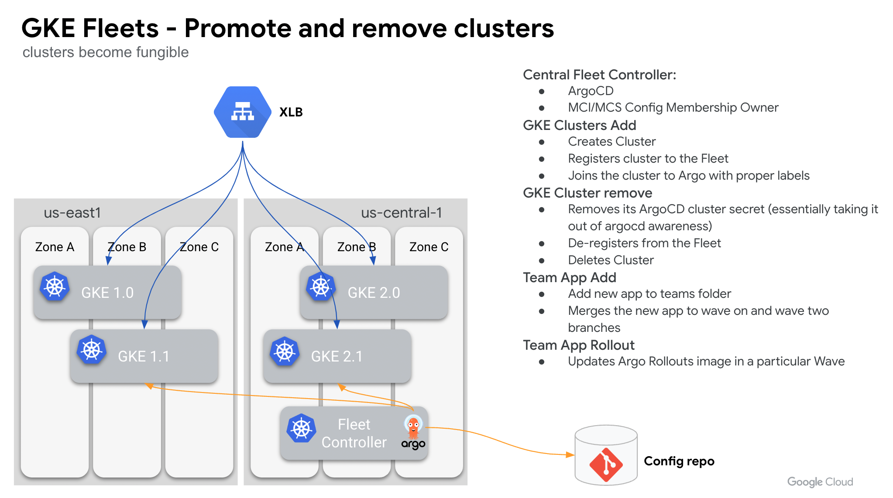

# 🚲 GKE Poc Toolkit Demo: GKE Fleet setup with ArgoCD
This demo shows you how to bootstrap a Fleet of GKE clusters using ArgoCD as your gitops engine.
Services in play:
* [Argocd](https://argo-cd.readthedocs.io/en/stable/)
* [Argo Rollouts](https://argoproj.github.io/argo-rollouts/)
* [GKE](https://cloud.google.com/kubernetes-engine/docs)
* [Multi Cluster Services](https://cloud.google.com/kubernetes-engine/docs/concepts/multi-cluster-services)
* [Multi Cluster Ingress](https://cloud.google.com/kubernetes-engine/docs/concepts/multi-cluster-ingress)
* [Anthos Service Mesh w/ Managed Control Plane](https://cloud.google.com/service-mesh/docs/overview#managed_anthos_service_mesh)




## Pre-reqs
If you don't have these tools already, please install:
* [ArgoCD CLI](https://argo-cd.readthedocs.io/en/stable/cli_installation/)
* Install the [Github CLI](https://github.com/cli/cli), make sure you are authenticated, and set your git defaults.
```bash
gh auth login
git config --global user.email "you@example.com"
git config --global user.name "Your Name"
``` 

## Fleet Infra setup

1. **Initiliaze the GKE POC Toolkit (gkekitctl init).** 
```bash
export GKE_PROJECT_ID=<your-project-id>
export OS="darwin" # choice of darwin or amd64 
gcloud config set project $GKE_PROJECT_ID
gcloud auth login
gcloud auth application-default login

ROOT_DIR=`pwd`
mkdir gke-poc-toolkit && cd "$_"
VERSION=$(curl -s https://api.github.com/repos/GoogleCloudPlatform/gke-poc-toolkit/releases/latest | grep browser_download_url | cut -d "/" -f 8 | tail -1)
curl -sLSf -o ./gkekitctl https://github.com/GoogleCloudPlatform/gke-poc-toolkit/releases/download/${VERSION}/gkekitctl-${OS} && chmod +x ./gkekitctl

./gkekitctl init
```

2. **Clone the demo repo and copy folders that house dry configs for this demo.**
```bash
cd ${ROOT_DIR}
git clone https://github.com/GoogleCloudPlatform/gke-poc-toolkit-demos.git  
cp -rf gke-poc-toolkit-demos/gke-fleets-with-argocd/argo-repo-sync ./
cp -rf gke-poc-toolkit-demos/gke-fleets-with-argocd/argo-cd-gke ./
cp -rf gke-poc-toolkit-demos/gke-fleets-with-argocd/scripts ./ 
cp -rf gke-poc-toolkit-demos/gke-fleets-with-argocd/config.yaml ./gke-poc-toolkit/config.yaml
rm -rf gke-poc-toolkit-demos
```

3. **Export vars and add them to your GKE POC toolkit config.yaml.**
``` bash
cd ${ROOT_DIR}/gke-poc-toolkit 
if [[ "$OSTYPE" == "darwin"* ]]; then
  sed -i '' -e "s/clustersProjectId: \"my-project\"/clustersProjectId: \"${GKE_PROJECT_ID}\"/g" config.yaml
  sed -i '' -e "s/governanceProjectId: \"my-project\"/governanceProjectId: \"${GKE_PROJECT_ID}\"/g" config.yaml
  sed -i '' -e "s/vpcProjectId: \"my-host-project\"/vpcProjectId: \"${GKE_PROJECT_ID}\"/g" config.yaml
else
  sed -i -e "s/clustersProjectId: \"my-project\"/clustersProjectId: \"${GKE_PROJECT_ID}\"/g" config.yaml
  sed -i -e "s/governanceProjectId: \"my-project\"/governanceProjectId: \"${GKE_PROJECT_ID}\"/g" config.yaml
  sed -i -e "s/vpcProjectId: \"my-host-project\"/vpcProjectId: \"${GKE_PROJECT_ID}\"/g" config.yaml
fi
```

4. **Run `./gkekitctl create --config config.yaml` from this directory.** This will take about 15 minutes to run.

5. **Connect to your newly-created GKE clusters**

```bash
gcloud container clusters get-credentials mccp-central-01 --region us-central1 --project ${GKE_PROJECT_ID}
```

6. **We highly recommend installing [kubectx and kubens](https://github.com/ahmetb/kubectx) to switch kubectl contexts between clusters with ease. Once done, you can validate you clusters like so.**
```bash
kubectx mccp-central-01=gke_${GKE_PROJECT_ID}_us-central1_mccp-central-01
kubectl get nodes
```

*Expected output for each cluster*: 
```bash
NAME                                                  STATUS   ROLES    AGE   VERSION
gke-mccp-central-01-linux-gke-toolkit-poo-12b0fa78-grhw   Ready    <none>   11m   v1.21.6-gke.1500
gke-mccp-central-01-linux-gke-toolkit-poo-24d712a2-jm5g   Ready    <none>   11m   v1.21.6-gke.1500
gke-mccp-central-01-linux-gke-toolkit-poo-6fb11d07-h6xb   Ready    <none>   11m   v1.21.6-gke.1500
```
7. **Now we are going to delete the app clusters you created for a better demo flow.**
```bash
## Ensure the mccp cluster is the ingress config controller
gcloud container fleet ingress update --config-membership=mccp-central-01-membership -q

## Unregister the app clusters from the Fleet
gcloud container fleet memberships unregister gke-std-west01 --gke-cluster=us-west1/gke-std-west01 --project ${GKE_PROJECT_ID} -q
gcloud container fleet memberships unregister gke-std-east01 --gke-cluster=us-east1/gke-std-east01 --project ${GKE_PROJECT_ID} -q

## Delete the app clusters
gcloud container clusters delete gke-std-west01 --region us-west1 --project ${GKE_PROJECT_ID} -q --async
gcloud container clusters delete gke-std-east01 --region us-east1 --project ${GKE_PROJECT_ID} -q --async
```
## Fleet Cluster setup
So far we have the infrastructure laid out and now need to set up the multi cluster controller cluster with argocd, GKE Fleet components, and some other tooling needed for the demo. 

1. **Hydrate those configs with our project specific variable by running the Fleet prep script**
First you need to create a github PAT token with repo permissions. Here is a link that explains how. https://docs.github.com/en/authentication/keeping-your-account-and-data-secure/creating-a-personal-access-token
```bash
cd ${ROOT_DIR}
# Create a var for your PAT token 
PAT_TOKEN=""
# Name for the private github repo that will be created
REPO=""
./scripts/fleet_prep.sh -p ${GKE_PROJECT_ID} -r ${REPO} -t ${PAT_TOKEN}
# Get your temp argocd admin password
kubectl -n argocd get secret argocd-initial-admin-secret -o jsonpath="{.data.password}" | base64 -d; echo
# Login to Argocd
argocd login "argocd.endpoints.${GKE_PROJECT_ID}.cloud.goog" --username admin
# Update your argocd admin password.
argocd account update-password --grpc-web
```

## Promoting Application Clusters to the Fleet
Now that we have the multi cluster controller cluster setup, we need to create and promote a GKE cluster to the Fleet that will run applications. Since the multi cluster networking configs have been hydrating, adding a cluster with the env=prod label on the argocd cluster secret will ensure the new cluster sync all the baseline tooling it needs, including ASM Gateways. We have also tagged this first cluster as a wave one cluster. The wave will be leveraged once apps start getting added.

1. **Run the application cluster add script**
```bash
./scripts/fleet_cluster_add.sh -p ${GKE_PROJECT_ID} -n gke-std-west01 -l us-west1-b -c "172.16.10.0/28" -t "standard" -w one
```

2. **Browse to the Argocd UI and you will see that the configs in subfolders in the app-clusters-config folder are installing. This state is all driven by the app clusters tooling application set which targets clusters labeled as prod.**

## Creating a new app from the app template
One application cluster is ready to serve apps. Now all we need to do is create configs for a new app and push them up to the Argocd sync repo and all the prep we have done will simply allow this app to start serving traffic through the ASM gateway.

1. **Run the team_app_add script**
```bash
./scripts/team_app_add.sh -a whereami -i "gcr.io/google-samples/whereami:v1.2.6" -p ${GKE_PROJECT_ID} -t team-2 -h "whereami.endpoints.${GKE_PROJECT_ID}.cloud.goog"
```

2. **Take a peek at the Argocd UI, filter by the team-2 project for easier location of applications, and you will see that the whereami app is starting to rollout to all application servers labeled was wave-one (there is only one at this point).**

3. **Once the whereami pod have started navigate to it's endpoint and you will see that you are routed to a pod living in the us-west region. You can also curl the endpoint to the same effect.**
```bash
curl https://whereami.endpoints.${GKE_PROJECT_ID}.cloud.goog/
# The output should look something like this...
{
  "cluster_name": "gke-std-west02", 
  "host_header": "whereami.endpoints.argo-spike.cloud.goog", 
  "pod_name": "whereami-rollout-6d6cb979b5-5xzpj", 
  "pod_name_emoji": "🇨🇵", 
  "project_id": "argo-spike", 
  "timestamp": "2022-08-01T16:16:56", 
  "zone": "us-west1-b"
}
```

## Add another application cluster to the Fleet
Let's get another application cluster added to the Fleet. This time we will deploy the cluster to us-east and label it as a wave two cluster.

1. **Run the application cluster add script**
```bash
./scripts/fleet_cluster_add.sh -p ${GKE_PROJECT_ID} -n gke-std-east01 -l us-east1-b -c "172.16.11.0/28" -t "standard" -w two
```

2. **Once the whereami pod have started on the us-east cluster, refresh the endpoint webpage or curl it again and you will see that you are routed to a pod living in the region that is closest to you. If you are closer to the west coast and want to see the east coast pod in action you can deploy a GCE instance in the east coast and curl from there or feel free to spin up a curl container in the us-east cluster and curl the endpoint from there.**
```bash
curl https://whereami.endpoints.${GKE_PROJECT_ID}.cloud.goog/
# The output should look something like this...
{
  "cluster_name": "gke-std-east01",
  "host_header": "whereami.endpoints.argo-spike.cloud.goog",
  "pod_name": "whereami-rollout-6d6cb979b5-x9h4v",
  "pod_name_emoji": "🧍🏽",
  "project_id": "argo-spike",
  "timestamp": "2022-08-01T16:23:42",
  "zone": "us-east1-b"
}
```

## Rolling out new version of an app
So far we have added an application cluster to the Fleet and new apps to those clusters. We've not shown off the usage of the wave label just yet, so we will do that now. First we need to create a new app that does a better job showing off Argo rollouts. Then we will progressively release the app to wave one followed by wave two clusters with a manual gate in between. 

1. **Run the team_app_add script**
```bash
./scripts/team_app_add.sh -a rollout-demo -i "argoproj/rollouts-demo:green" -p ${GKE_PROJECT_ID} -t team-1 -h "rollout-demo.endpoints.argo-spike.cloud.goog"
```

2. **Release a new image of your app to wave one clusters**
```bash
./scripts/team_app_rollout.sh -a rollout-demo -t team-1 -i "argoproj/rollouts-demo" -l "yellow" -w "one"
```

3. **Check the state of your rollout in the argocd UI. You should see a new replicaset and pods being deployed with the new image tag and a progression through the steps of the rollout that generates an analysis templates result after each step. If the analysis does not pass, the rollout will stop and all traffic will be sent to the previous version.**


4. **Now that we have progressively release our new image to the first wave of clusters successfully we can move on to releasing the new image to wave two clusters.**
```bash
./scripts/team_app_rollout.sh -a rollout-demo -t team-1 -i "argoproj/rollouts-demo" -l "yellow" -w "two"
```

5. **All of the waves have been rolled out successfully and we need to merge the new image into main to conclude the rollout**
```bash
./scripts/team_app_rollout.sh -a rollout-demo -t team-1 -i "argoproj/rollouts-demo" -l "yellow" -w "done"
```


