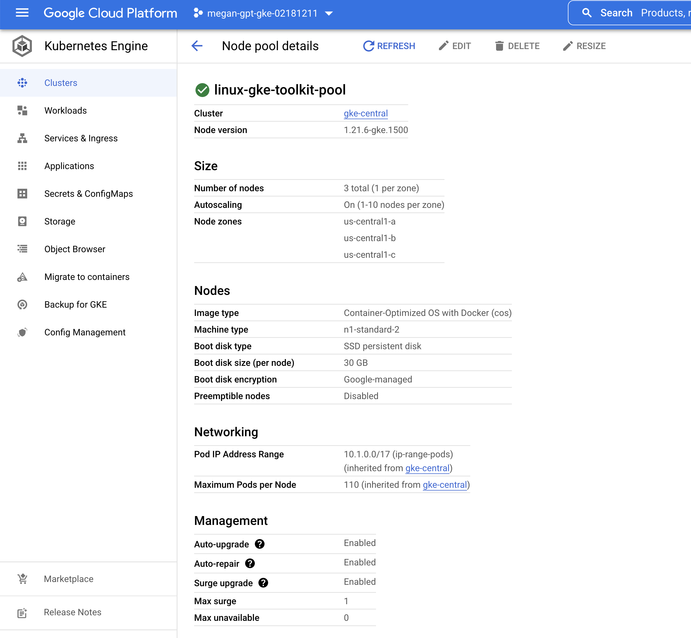
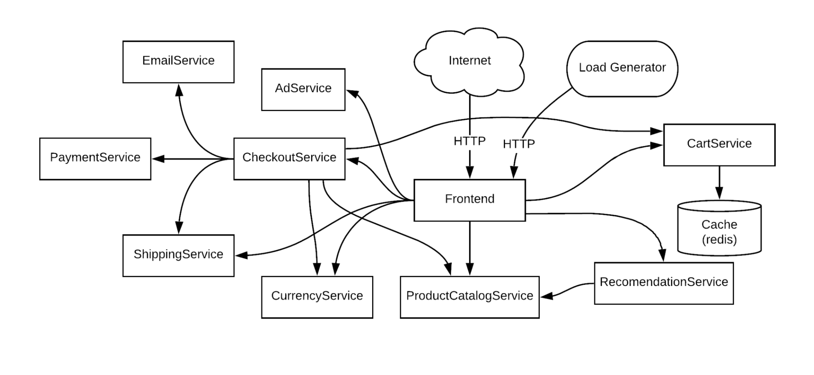
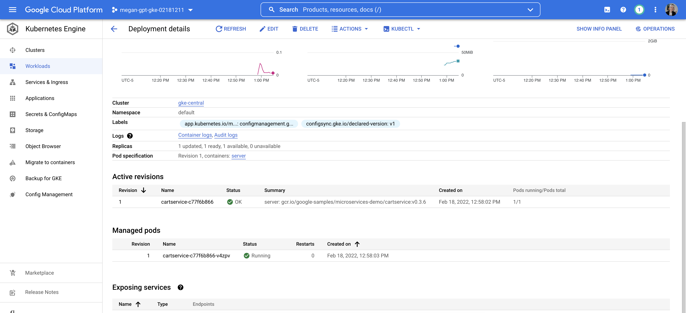
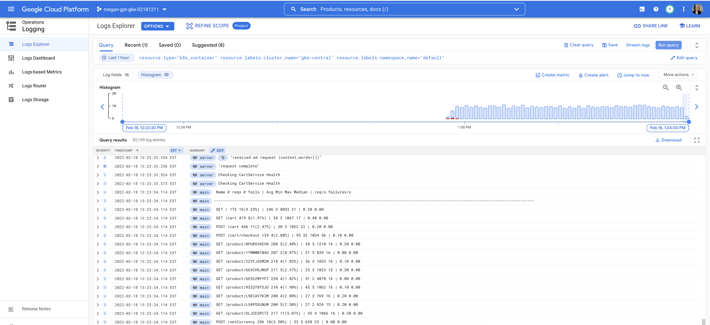
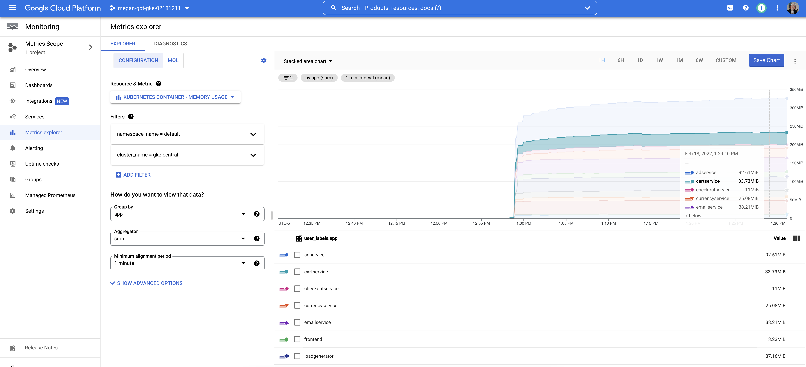

# 🚲 GKE Poc Toolkit Demo: Online Boutique (Single Cluster)

This is a simple, 1-cluster demo of the GKE Poc Toolkit using the [Online Boutique](https://github.com/GoogleCloudPlatform/microservices-demo) (microservices-demo) sample app. 

## How to run 

1. **Go through the [GKE PoC Toolkit quickstart](https://github.com/GoogleCloudPlatform/gke-poc-toolkit#quickstart) up until the `gkekitctl create` step.** 

2. **Export your project ID var.** 

```
export PROJECT_ID=<your-project-id>
```
3. **Edit `config.yaml` in this directory to replace `my-project` with your toolkit `PROJECT_ID`.** 

4. **Copy `config.yaml` to wherever you're running the toolkit from.**

5. **Run `gkekitctl create --config config.yaml` from this directory.** This will take about 10 minutes to run.

6. **Connect to your newly-created GKE cluster.** 

```bash
gcloud container clusters get-credentials gke-central --region us-central1 --project $PROJECT_ID
```

Verify that you can access your cluster: 

```
kubectl get nodes
```

*Expected output*: 
```bash
NAME                                                  STATUS   ROLES    AGE   VERSION
gke-gke-central-linux-gke-toolkit-poo-12b0fa78-grhw   Ready    <none>   11m   v1.21.6-gke.1500
gke-gke-central-linux-gke-toolkit-poo-24d712a2-jm5g   Ready    <none>   11m   v1.21.6-gke.1500
gke-gke-central-linux-gke-toolkit-poo-6fb11d07-h6xb   Ready    <none>   11m   v1.21.6-gke.1500
```

7. **Clone your Anthos Config Management (ACM) sync repo.** 

```
gcloud source repos clone gke-poc-config-sync --project=$PROJECT_ID
cd gke-poc-config-sync
```

8. **Download the latest Online Boutique release manifests into your ACM repo, then push to `main` branch.** This will effectively deploy the sample app to your GKE cluster.

```
wget https://raw.githubusercontent.com/GoogleCloudPlatform/microservices-demo/main/release/kubernetes-manifests.yaml --no-check-certificate
git checkout -b main
git add .
git commit -m "Deploy Online Boutique" 
git push origin main
```

*Expected output*: 

```
Saving to: ‘kubernetes-manifests.yaml’
kubernetes-manifests.yaml 100%[=====================================>]  17.28K  --.-KB/s    in 0.001s
...
Total 3 (delta 0), reused 0 (delta 0), pack-reused 0
To https://source.developers.google.com/p/megan-gpt-gke-02181211/r/gke-poc-config-sync
   c214414..4cfa20b  main -> main
```

9. **Watch for the Online Boutique Deployments and Services to be created via Config Sync.** 

```bash 
watch kubectl get pods
```

*Expected output*: 

```
NAME                                     READY   STATUS    RESTARTS   AGE
adservice-85598d856b-kh56b               1/1     Running   0          2m33s
cartservice-c77f6b866-v4zpv              1/1     Running   0          2m22s
checkoutservice-654c47f4b6-gpzqj         1/1     Running   0          2m24s
currencyservice-59bc889674-bqqst         1/1     Running   0          2m33s
emailservice-5b9fff7cb8-s56df            1/1     Running   0          2m22s
frontend-77b88cc7cb-89gvm                1/1     Running   0          2m33s
loadgenerator-6958f5bc8b-8j2r2           1/1     Running   0          2m17s
paymentservice-68dd9755bb-9qw5d          1/1     Running   0          2m24s
productcatalogservice-557ff44b96-4n6rs   1/1     Running   0          2m22s
recommendationservice-64dc9dfbc8-hs4ph   1/1     Running   0          2m23s
redis-cart-5b569cd47-fpg4g               1/1     Running   0          2m22s
shippingservice-5488d5b6cb-8zkfb         1/1     Running   0          2m23s
```

10. **View the Online Boutique frontend in a browser to verify successful deployment.** 

```bash 
kubectl get svc frontend-external
```

*Expected output*: 

```
NAME                TYPE           CLUSTER-IP   EXTERNAL-IP     PORT(S)        AGE
frontend-external   LoadBalancer   10.1.142.8   <your-external-ip>   80:30499/TCP   3m4s
```

Use the `EXTERNAL_IP` to access the Online Boutique frontend.


Your demo is ready to go! 🎉

# Explore the demo

If you're walking someone else through this demo, or using this to learn about GKE, here are some things you can look at.

## GKE Cluster 

[Link](https://console.google.com/kubernetes/list)

You can click on the cluster name to view its details: cluster's region, what VPC network it's on, security features like [Shielded Nodes](https://cloud.google.com/kubernetes-engine/docs/how-to/shielded-gke-nodes) and [Workload Identity](https://cloud.google.com/kubernetes-engine/docs/concepts/workload-identity) are enabled. 

You can go to the Nodes tab to see the cluster's [Node Pools](https://cloud.google.com/kubernetes-engine/docs/concepts/node-pools): how many nodes per pool, what operating system your nodes use. 



## Config Sync 

[Link](https://console.cloud.google.com/kubernetes/config_management)

[Config Sync](https://cloud.google.com/anthos-config-management/docs/config-sync-overview) is installed on your GKE cluster during `create`. 

If you click on your cluster's name, an info panel appears to the right, showing your cluster's sync status (+ any errors), and the install settings for ACM (eg. [Policy Controller](https://cloud.google.com/anthos-config-management/docs/concepts/policy-controller) enabled, what repo Config Sync is syncing from, what branch.)


## GKE Workloads 

[Link](https://console.cloud.google.com/kubernetes/workload)

The app you just deployed is called [Online Boutique](https://github.com/GoogleCloudPlatform/microservices-demo). It's a sample retail web application for an online store. There are 11 microservices that make up this application. All services - including the Redis database - run inside your GKE cluster.  



You can show how the Online Boutique app maps to specific Kubernetes objects. 
For instance, the Workloads tab shows you the app's Deployments (you can filter on `namespace:default` to filter out system / ACM workloads.) If you click on one Deployment, for instance "cartservice," you can see how the Deployment spawns Pods, running the containerized service. 




And back in the deployment, you can see how cartservice also gets a Kubernetes service, allowing all backing pods to be reachable within the cluster. (ie. so that the frontend can add things to the user's cart.)

## Containers

To go a step further, you can see how cartservice + others are packaged up so that they can run as containers inside GKE. 

To do this, open the [cartservice's source code directory](https://github.com/GoogleCloudPlatform/microservices-demo/tree/main/src/cartservice/src), and click on [Dockerfile](https://github.com/GoogleCloudPlatform/microservices-demo/blob/main/src/cartservice/src/Dockerfile). You'll see something like this: 

```Dockerfile
FROM mcr.microsoft.com/dotnet/sdk:6.0.102 as builder
WORKDIR /app
COPY cartservice.csproj .
RUN dotnet restore cartservice.csproj -r linux-musl-x64
COPY . .
RUN dotnet publish cartservice.csproj -p:PublishSingleFile=true -r linux-musl-x64 --self-contained true -p:PublishTrimmed=True -p:TrimMode=Link -c release -o /cartservice --no-restore

# https://mcr.microsoft.com/v2/dotnet/runtime-deps/tags/list
FROM mcr.microsoft.com/dotnet/runtime-deps:6.0.2-alpine3.14-amd64
RUN GRPC_HEALTH_PROBE_VERSION=v0.4.6 && \
    wget -qO/bin/grpc_health_probe https://github.com/grpc-ecosystem/grpc-health-probe/releases/download/${GRPC_HEALTH_PROBE_VERSION}/grpc_health_probe-linux-amd64 && \
    chmod +x /bin/grpc_health_probe
WORKDIR /app
COPY --from=builder /cartservice .
ENV ASPNETCORE_URLS http://*:7070
ENTRYPOINT ["/app/cartservice"]
```

A [Dockerfile](https://docs.docker.com/engine/reference/builder/#:~:text=A%20Dockerfile%20is%20a%20text,can%20use%20in%20a%20Dockerfile%20.) tells a container builder (eg. `docker` CLI) how to build the source code into a container. The Online Boutique team has CI that automatically builds this container using the Dockerfile, and pushes it to Google Container Registry [here](https://gcr.io/google-samples/microservices-demo/cartservice). That "release" container image [is what you just deployed to GKE](https://github.com/GoogleCloudPlatform/microservices-demo/blob/main/release/kubernetes-manifests.yaml#L435); you didn't have to build this on your own. 

## gRPC 

Online Boutique's backend services use [gRPC](https://grpc.io/) as their transport protocol, whereas the frontend uses regular HTTP. If your audience is interesting in seeing how gRPC works, you can... 

- Show a proto file - eg. [cartservice](https://github.com/GoogleCloudPlatform/microservices-demo/blob/main/pb/demo.proto#L21). This is the gRPC service spec used to generate the client and server code in cartservice's target language, C#.  

- Show a gRPC client. The frontend talks to cartservice [like this](https://github.com/GoogleCloudPlatform/microservices-demo/blob/main/src/frontend/handlers.go#L225). 

- Show a gRPC server. [Here's how the cartservice serves requests.](https://github.com/GoogleCloudPlatform/microservices-demo/blob/main/src/cartservice/src/services/CartService.cs#L34)


## Logging

[Observability](https://cloud.google.com/architecture/devops/devops-measurement-monitoring-and-observability) is an important part of running any application in the cloud. GKE makes observability easy by exporting your container's application logs and basic metrics to Google Cloud Operations.

[Link](https://console.cloud.google.com/logs/query)

View the application logs across all Online Boutique services by running this query: 

```
resource.type="k8s_container" resource.labels.cluster_name="gke-central" resource.labels.namespace_name="default"
```



## Monitoring 

[Link](https://console.cloud.google.com/monitoring/metrics-explorer)

[GKE sends System metrics](https://cloud.google.com/stackdriver/docs/solutions/gke/managing-metrics) to Google Cloud Monitoring, including pod CPU and memory usage. ([Full list](https://cloud.google.com/monitoring/api/metrics_kubernetes)). 

For instance, you can view GKE pod memory usage across all Online Boutique services, by opening the Metrics Explorer (link above), going to the MQL tab, and running this query:

```
fetch k8s_container
| metric 'kubernetes.io/container/memory/used_bytes'
| filter
    (resource.cluster_name == 'gke-central'
     && resource.namespace_name == 'default')
| group_by 1m, [value_used_bytes_mean: mean(value.used_bytes)]
| every 1m
| group_by [metadata.user.app: metadata.user_labels.app],
    [value_used_bytes_mean_aggregate: aggregate(value_used_bytes_mean)]
```

You should see something like this: 


